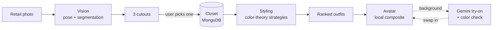
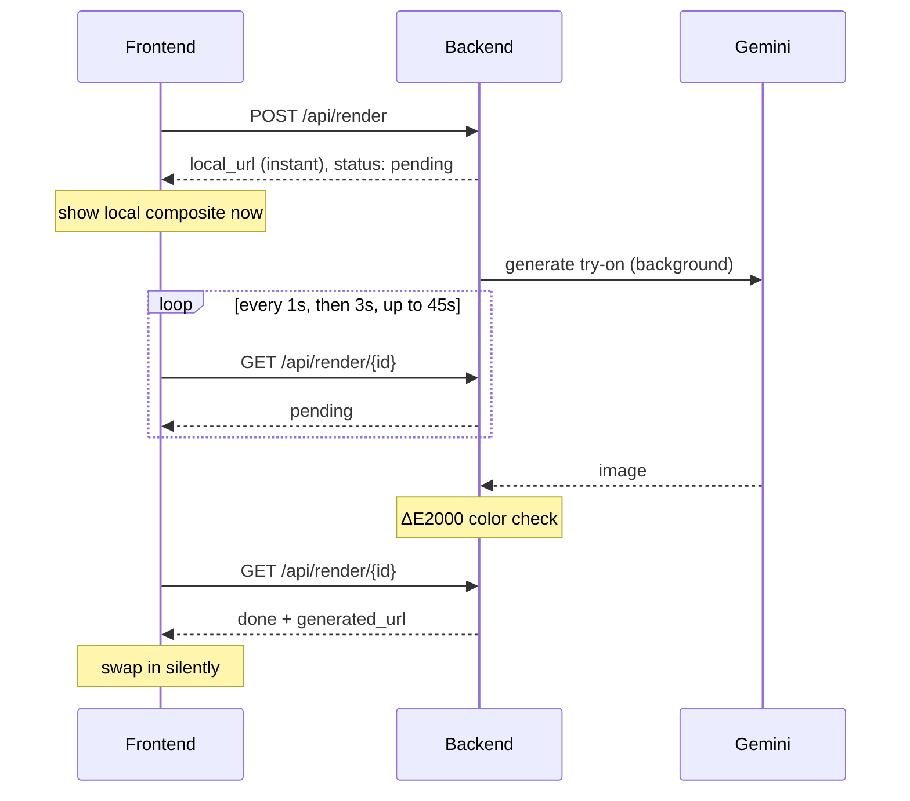

<div align="center">

# Atelier

### Your closet, styled by color theory.

Snap a retail photo of a garment. Atelier cuts it off the model, measures its true color, and
files it in your digital closet. Tap **generate outfit** for a color-harmony recommendation,
then see the look on an avatar built from a scan of you.

<br>


<br>

**[How it works](#how-it-works)** ·
**[Features](#features)** ·
**[Quick start](#quick-start)** ·
**[API](#api-at-a-glance)** ·
**[Architecture](#architecture)** ·
**[Demo](#demo)**

</div>

<br>

> [!NOTE]
> Hackathon project, in active development. The backend is feature-complete for the demo; the
> frontend is being connected now.

---

## Features

<table>
<tr>
<td width="50%" valign="top">

### Garment ingest
Upload a retail photo and get **three candidate cutouts** (tight, balanced, generous), isolated
from the model with pose-guided segmentation. Nothing is saved until you pick one.

</td>
<td width="50%" valign="top">

### Real color measurement
K-means clustering in **CIELAB** finds each garment's primary and secondary color. Colors stay
numeric; "neutral" is computed from chroma, never guessed from a name.

</td>
</tr>
<tr>
<td width="50%" valign="top">

### Color-theory outfits
Named strategies (*neutral anchor*, *everyday-neutral base*, *analogous*, *complementary*)
feed a **pure, deterministic scorer**. Up to five ranked outfits, each with a one-line reason.

</td>
<td width="50%" valign="top">

### Try it on
A scan becomes an avatar built from **your own body**, cut out of the photo head to feet (a
line-art figure covers the loading state and any fallback). Tap **See it on me** and outfits
appear instantly as a local composite, then a **Gemini-generated try-on** swaps in once it
passes a color check.

</td>
</tr>
</table>

> [!TIP]
> **Nothing ever breaks in front of the user.** If generation is slow, fails, or runs out of
> quota, the local composite simply stays on screen. Explanations fall back to built-in text
> within 2.5 seconds.

---

## How it works



<details>
<summary><b>Step by step</b></summary>
<br>

1. **Ingest.** MediaPipe finds the model's pose and segments their clothing. The garment region
   comes from body landmarks and depends on the garment type (a dress runs shoulder to ankle),
   producing three candidate cutouts.
2. **Measure.** K-means in CIELAB over the cutout's pixels gives a primary and, when it's distinct
   enough, a secondary color. Names and families come from a lookup table.
3. **Recommend.** Each strategy proposes outfits (`bottom + top-or-dress + optional jacket`);
   the scorer ranks them and selection keeps variety (at most two per strategy).
4. **Render.** Tapping **See it on me** returns the local composite in under 100 ms. Gemini
   generates the try-on in the background (~10 s); the result is checked against each garment's
   measured color (ΔE2000) before the frontend swaps it in.

</details>

---

## Tech stack

| Layer | Technology |
|:--|:--|
| **Frontend** | Next.js (App Router) · TypeScript · Tailwind CSS |
| **Backend** | Python 3.12 · FastAPI · Pydantic |
| **Computer vision** | MediaPipe (pose, multiclass segmentation, face detection) · OpenCV · scikit-image · scikit-learn |
| **Generative AI** | Google Gemini (image try-on, outfit explanations) |
| **Data** | MongoDB Atlas (items, avatars, renders) · GridFS for media |
| **Hosting** | Vercel (frontend) · DigitalOcean App Platform (backend, Docker) |

---

## Quick start

> [!IMPORTANT]
> You need **Python 3.12** (MediaPipe has no 3.14 build), **Node.js 20+**, a **MongoDB Atlas**
> connection string, and a **Gemini API key** from Google AI Studio (image generation needs
> billing enabled).

<details open>
<summary><b>Backend</b></summary>
<br>

```bash
# from the repo root
python3.12 -m venv .venv
.venv/Scripts/python.exe -m pip install -r backend/requirements.txt   # macOS/Linux: .venv/bin/python

cp backend/.env.example backend/.env    # fill in MONGODB_URI and GEMINI_API_KEY

.venv/Scripts/python.exe -m uvicorn backend.main:app --port 8000
```

`http://localhost:8000/api/health` → `{"status":"ok","db":"ok"}`

MediaPipe model files download automatically on first use.

</details>

<details>
<summary><b>Demo closet (optional)</b></summary>
<br>

Load the sample garments in `fixtures/images/` into your database. Safe to re-run.

```bash
.venv/Scripts/python.exe backend/vision/scripts/seed_closet.py
.venv/Scripts/python.exe tools/sync_media.py      # upload any local-only images to MongoDB
```

</details>

<details open>
<summary><b>Frontend</b></summary>
<br>

```bash
cd frontend
npm install
npm run dev        # http://localhost:3000
```

`next.config.ts` proxies `/api/*` and `/media/*` to `BACKEND_URL` (default
`http://localhost:8000`), so the frontend only ever uses relative URLs.

**Screens:**

| Route | What it does |
|:--|:--|
| `/` | Landing |
| `/closet` | Swipe tops and bottoms, generate outfits |
| `/scan` | Camera capture with a consent notice and countdown; `?backup=<avatar_id>` skips straight to a pre-scanned avatar |
| `/add-item` | Ingest a garment: analyze, pick a candidate, save |
| `/stylist` | The two-stage render — local composite on tap, Gemini try-on swapped in silently once it's verified |

</details>

---

## API at a glance

All routes live under `/api`. Errors are always `{"error": {"code": "...", "message": "..."}}`.

| Method | Path | What it does |
|:--|:--|:--|
| `GET` | `/api/health` | Backend and database status |
| `POST` | `/api/items/analyze` | Garment photo (multipart) → 3 candidate cutouts, nothing saved |
| `POST` | `/api/items/save` | Keep one candidate → saved item |
| `POST` | `/api/items/reject` | Discard all three candidates |
| `GET` | `/api/items` | The closet, newest first (`?category=tops\|bottoms\|jackets`) |
| `GET` | `/api/items/{slug}` | One item with its measured colors |
| `POST` | `/api/outfits/generate` | Up to 5 ranked outfits with strategy and explanation |
| `POST` | `/api/avatar/scan` | Full-body photo (multipart) → avatar, or a specific pose correction |
| `GET` | `/api/avatar/{avatar_id}` | One avatar |
| `POST` | `/api/render` | Outfit on avatar → instant local composite |
| `GET` | `/api/render/{render_id}` | Poll until `done` (swap in `generated_url`) or `failed` (keep local) |

Full behavior: [`coordination/BACKEND_API.md`](coordination/BACKEND_API.md) ·
Types: [`contract/schema.json`](contract/schema.json) ·
Examples: [`contract/fixtures/api/`](contract/fixtures/api/)

<details>
<summary><b>The two-stage render, visualized</b></summary>
<br>

Rendering is triggered only by an explicit **See it on me** tap, never by swiping or selecting
garments — every new combination starts a paid, ~10 s Gemini generation, so nothing runs
speculatively.



</details>

---

## Architecture

```
backend/
├── main.py            FastAPI app: routers under /api, media under /media
├── config.py          settings from backend/.env (model versions pinned)
├── db.py              MongoDB access
├── media_store.py     durable media in GridFS, local disk as a cache
├── routes/            items.py · outfits.py · avatar.py
├── vision/            segmentation, cutouts, color extraction, quality checks
├── styling/           scorer, strategies, selection, explanations
├── avatar/            pose validation, rig, drawing, compositing, Gemini try-on
└── tests/             offline test suite
contract/              API contract: Pydantic models, enums, JSON Schema, fixtures
coordination/          BACKEND_API.md, the frontend's guide to every endpoint
frontend/              Next.js app
fixtures/              sample garment photos for tests and the demo closet
tools/                 checks and maintenance scripts
```

**Design principles**

- **One contract.** Backend and frontend both build against `contract/`; types are generated
  from its JSON Schema.
- **Colors are numbers.** Lab values everywhere; names are a lookup, and chroma decides
  what's neutral.
- **Pure scoring.** No I/O in the scorer: same closet, same outfits.
- **The local path always works.** Generation is an enhancement that may silently fail.
- **A dress is a top.** It lives in the tops list and layers over a bottom.

---

## Testing

```bash
.venv/Scripts/python.exe -m pytest -q                  # backend suite, fully offline
.venv/Scripts/python.exe -m contract.check_contract    # contract models and fixtures agree
.venv/Scripts/python.exe tools/check_docs.py           # project docs don't contradict each other
```

The database, media storage, and Gemini are replaced with in-memory stand-ins, so the suite never
touches the network.

---

## Demo

Live demo script, timestamps, and a fallback plan for the two presenters:
[`docs/DEMO_SCRIPT.md`](docs/DEMO_SCRIPT.md).

---

## Known limitations

- **Garments must be worn by a model.** Ingest locates the garment from the model's pose, so the upper body must be in frame; tight waist-down crops and flat-lays get a clear rejection.
- **Striped and two-tone garments** report the larger base color as primary (a green-striped cream sweater reads as cream), with the accent as secondary.
- **Light-wash denim** sits on the blue/gray boundary and may be named gray.
- **Generated try-on** takes ~10 s and uses API quota; each outfit combination is generated once and cached.

---

## Privacy

The avatar scan and try-on send the user's photo to Google's Gemini API, and the app says so
before capture. Face photos and garment images are stored in the project's MongoDB database.

---

## Team

> **TODO:** names and roles.

<div align="center">
<br>

<sub>Built for a hackathon with FastAPI, MediaPipe, MongoDB Atlas, and Google Gemini.</sub>

</div>
