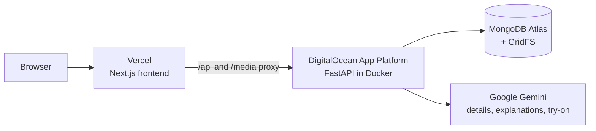

<div align="center">

# Atelier

### Your closet, styled by color theory.

Snap a garment photo (a product shot, a flat-lay, or a piece on a hanger). Atelier cuts it out,
measures its true color, fills in its details, and files it in your digital closet. Tap
**generate outfit** for a color-harmony recommendation, then see the look on an avatar built
from a scan of you.

<br>


<br>

**[Features](#features)** ·
**[Frontend](#frontend)** ·
**[Backend](#backend)** ·
**[API](#api-at-a-glance)** ·
**[Architecture](#architecture--deploy)** ·
**[Run locally](#run-locally)**

</div>

<br>

---

## Features

<table>
<tr>
<td width="50%" valign="top">

### Garment ingest
Upload a garment photo and pick one of **three candidate cutouts**. Photos worn by a model are
cut with pose-guided segmentation; product photos, flat-lays and hanger shots go to a flat-lay
cutter that handles busy backgrounds. The garment's details are filled in automatically.
Nothing is saved until you pick a cutout.

</td>
<td width="50%" valign="top">

### Real color measurement
K-means in **CIELAB** finds each garment's primary and secondary color. Colors stay numeric;
"neutral" is computed from chroma, never guessed from a name. Each color also gets a friendly
display name for people rather than for the scorer.

</td>
</tr>
<tr>
<td width="50%" valign="top">

### Color-theory outfits
Six strategies (*neutral anchor*, *everyday-neutral base*, *analogous*, *complementary*,
*monochrome + highlight*, *sandwich*) feed a **pure, deterministic scorer**, backed by a color
dressing guide of proven pairings (including light and dark denim). Pick a style: Random,
Casual, Fancy, Business or Monochrome. Every outfit comes with a short explanation.

</td>
<td width="50%" valign="top">

### Try it on
A scan becomes an avatar cut from **your own body**. Tap **Try On!** and **Nano Banana 2**
dresses the avatar, preserving your face and layering jackets correctly. Results pass a
garment-color and identity check before they are shown. After a scan, likely outfits are
generated early in the background.

</td>
</tr>
</table>

> [!TIP]
> **Nothing wrong ever reaches the screen.** A try-on that fails its checks is not shown, busy
> responses from the model are retried, and explanations fall back to built-in text.

---

## Frontend

Next.js (App Router) + TypeScript in `frontend/`. No business logic lives here; the FastAPI
backend makes every decision. A drifting sky background runs behind every page, and the hanger
menu holds the page links plus a **demo avatar** switch.

| Route | What it does |
|:--|:--|
| `/` | Home |
| `/scan` | Consent notice, then camera or upload; a pose check lists anything to fix; the result is a real-body avatar standing on a floor shadow. The backend's `/api/phone` page lets you take the photo on a phone |
| `/closet` | One carousel per category, items labeled top-N / bottom-N / jacket-N, with drop shadows. Each item has an info popup (main color, auto-filled details), an edit pencil with pickers (including n/a and free text), and a plus button that makes it the stylist default. Links to add an item |
| `/add-item` | Upload a garment photo (product photo, flat-lay or on a hanger) and pick one of 3 cutouts; details are filled automatically |
| `/stylist` | Garment rails and a jacket toggle; **Try On!** renders the current selection. **generate outfit** with Random / Casual / Fancy / Business / Monochrome; a curtain covers the avatar while Nano Banana works. The outfit shows connected color dots and explanation text; save and name outfits, and reopen them from the saved-outfits drawer |
| `/insights` | Your palette: neutral share, color families, a seasonal palette read, and suggestions |

---

## Backend

FastAPI on Python 3.12 in `backend/`, built contract-first: `contract/schemas.py` (version in
`CONTRACT_VERSION`, currently 2.6.0) defines every request and response.

| Area | What it does |
|:--|:--|
| **Vision** (`backend/vision/`) | MediaPipe pose + segmentation for model photos; a flat-lay cutter for product photos, including busy backgrounds and hangers; Lab color extraction with friendly names; garment details from a single Gemini call |
| **Styling** (`backend/styling/`) | Deterministic color-theory scorer with 6 strategies, a color dressing guide of pairings (light/dark denim included), style presets, explanations, and palette insights with a seasonal read |
| **Avatar** (`backend/avatar/`) | Real-body cutout avatar from a scan; Nano Banana 2 try-on (`gemini-3.1-flash-image`) with a prompt covering face preservation and layering; color and identity checks; transparent output; early try-ons after a scan; retry when the model is busy |
| **Storage** | MongoDB Atlas for the closet, avatars and renders; GridFS for media |

### API at a glance

All routes live under `/api`. Errors are always `{"error": {"code": "...", "message": "..."}}`.

| Method | Path | What it does |
|:--|:--|:--|
| `GET` | `/api/health` | Backend and database status |
| `POST` | `/api/items/analyze` | Garment photo (multipart) → 3 candidate cutouts, nothing saved |
| `POST` | `/api/items/save` | Keep one candidate → saved item |
| `POST` | `/api/items/reject` | Discard all three candidates |
| `GET` | `/api/items` | The closet, newest first |
| `GET` | `/api/items/{slug}` | One item with its measured colors and details |
| `PATCH` | `/api/items/{slug}` | Edit an item's name or details |
| `DELETE` | `/api/items/{slug}` | Archive an item (reversible) |
| `POST` | `/api/outfits/generate` | Ranked outfits with strategy and explanation (optional style preset) |
| `POST` | `/api/avatar/scan` | Full-body photo (multipart) → avatar, or a specific pose correction |
| `GET` | `/api/avatar/{avatar_id}` | One avatar |
| `POST` | `/api/render` | Start a try-on of an outfit on an avatar |
| `GET` | `/api/render/{render_id}` | Poll until `done` or `failed` |
| `GET` | `/api/insights/palette` | Closet-wide color summary and insights |
| `GET` | `/api/phone` | Auxiliary: phone upload page for the scan photo |
| `GET` | `/api/phone/latest` | Auxiliary: the latest photo sent from the phone |

Full behavior: [`coordination/BACKEND_API.md`](coordination/BACKEND_API.md) ·
Types: [`contract/schema.json`](contract/schema.json) ·
Examples: [`contract/fixtures/api/`](contract/fixtures/api/)

---

## Architecture & deploy



`next.config.ts` proxies `/api/*` and `/media/*` to `BACKEND_URL`, so the frontend only uses
relative URLs.

**Environment variables** (names only; start from `backend/.env.example` and never commit values):

| Where | Variables |
|:--|:--|
| Frontend (Vercel) | `BACKEND_URL`, `NEXT_PUBLIC_DEMO_AVATAR_ID`, `NEXT_PUBLIC_BACKUP_AVATAR_ID` |
| Backend (DigitalOcean) | `GEMINI_API_KEY`, `MONGODB_URI`, `GEMINI_IMAGE_MODEL`, `ATELIER_PREWARM_ENABLED`, `ATELIER_DEMO_OUTFITS` |

```
backend/
├── main.py            FastAPI app: routers under /api, media under /media
├── config.py          settings; Gemini model versions pinned
├── db.py              MongoDB access
├── media_store.py     durable media in GridFS, local disk as a cache
├── routes/            items · outfits · avatar · insights
├── vision/            segmentation, flat-lay cutter, color extraction, details
├── styling/           scorer, strategies, pairing guide, presets, explanations, insights
├── avatar/            pose validation, body cutout, Gemini try-on and checks
└── tests/             offline test suite
contract/              API contract: Pydantic models, enums, JSON Schema, fixtures
coordination/          BACKEND_API.md and cross-laptop coordination
frontend/              Next.js app
tools/                 checks and maintenance scripts
```

**Design principles**

- **One contract.** Backend and frontend both build against `contract/`.
- **Colors are numbers.** Lab values everywhere; names are a lookup, and chroma decides
  what's neutral.
- **Pure scoring.** No I/O in the scorer: same closet, same outfits.
- **A dress is a top.** It lives in the tops list and layers over a bottom.

---

## Run locally

> [!IMPORTANT]
> You need **Python 3.12** (MediaPipe has no 3.14 build), **Node.js 20+**, a **MongoDB Atlas**
> connection string, and a **Gemini API key** (image generation needs billing enabled).

**Backend** (repo root):

```bash
python3.12 -m venv .venv
.venv/Scripts/python.exe -m pip install -r backend/requirements.txt   # macOS/Linux: .venv/bin/python
cp backend/.env.example backend/.env    # fill in MONGODB_URI and GEMINI_API_KEY
.venv/Scripts/python.exe -m uvicorn backend.main:app --port 8000
```

`http://localhost:8000/api/health` → `{"status":"ok","db":"ok"}`

**Frontend:**

```bash
cd frontend && npm ci && npm run dev    # http://localhost:3000
```

`BACKEND_URL` defaults to `http://localhost:8000`.

**Tests** (fully offline; the database, media storage and Gemini are in-memory stand-ins):

```bash
.venv/Scripts/python.exe -m pytest -q                  # backend suite
.venv/Scripts/python.exe -m contract.check_contract    # contract models and fixtures agree
.venv/Scripts/python.exe tools/check_docs.py           # project docs don't contradict each other
```

---

## Demo

Live demo script and fallback plan: [`docs/DEMO_SCRIPT.md`](docs/DEMO_SCRIPT.md).

---

## Known limitations

- **Striped and two-tone garments** report the larger base color as primary, with the accent as secondary.
- **Light-wash denim** sits on the blue/gray boundary and may be named gray.
- **Generated try-on** takes several seconds and uses API quota; each combination is cached once generated.

---

## Privacy

The avatar scan and try-on send the user's photo to Google's Gemini API, and the app says so
before capture. Face photos and garment images are stored in the project's MongoDB database.

---

## Team

- Lalitha Kantam
- Sarah Spellman

<div align="center">
<br>

<sub>Built for a hackathon with FastAPI, Next.js, MediaPipe, MongoDB Atlas, and Google Gemini.</sub>

</div>
