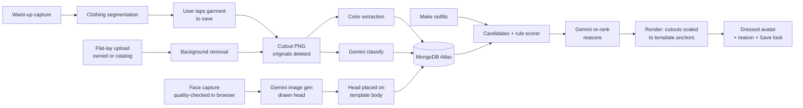
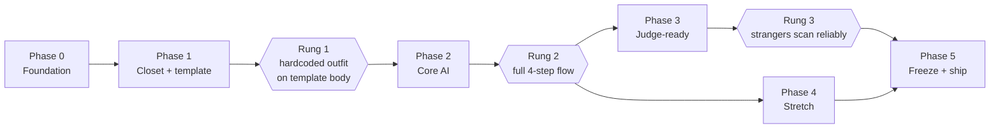

# Closet App PRD — 36-Hour Hackathon

Sep 26, 2026

## 1. Problem and target user

People with disorganized wardrobes can't see what they own or which pieces work together, so they default to the same few outfits. The product scans the user into a drawn avatar, turns what they're wearing into closet items, and builds outfits on demand that are shown on the avatar.

**Target user:** anyone with a disorganized closet, large or small. The demo uses a small closet because of limited resources; nothing in the design depends on closet size.

**Demo flow:**

1. The app opens and scans the user's face; a drawn avatar with their likeness appears on a template body.
2. The user steps back for a waist-up capture; their top (or jacket) is cut out and saved as a closet item.
3. They click **Make outfits**; an outfit built around that item, from pre-saved owned and catalog pieces, appears with a one-line reason.
4. The outfit is layered onto their avatar.

**AI features to emphasize:** the face-to-avatar scan, garment segmentation, and the outfit recommendations.

**Team goals beyond winning:** technically substantive CV/ML components, resume-worthy bullets, and real learning exposure.

**Out of scope for this PRD:** visual design and art (the team provides layout drawings and the template body) and the pitch.

## 2. Scoped MVP

The MVP is the four-step demo flow: face scan → top into the closet → **Make outfits** → outfit on the avatar. Everything above the cut line must work before stretch work starts.

**The template body is what makes the avatar reliable.** Only the head is personalized. The body is one team-drawn figure in a fixed pose with fixed anchor points (neck, shoulders, waist, hips), so every garment is placed by scaling it to those slots. No body tracking is needed, and it works the same for every user.

**Framing constraint:** a face-only shot doesn't show enough of the top to cut it out. The scan therefore takes two captures: a close-up for the face, then a waist-up capture at about 1–1.5 m, which a laptop webcam can handle. If the waist-up capture fails, the user hands over the garment and it goes through the flat-lay path.

| Feature | Tag | Notes |
| --- | --- | --- |
| **Guided scan:** face outline and countdown, then a waist-up outline and countdown, with a quality check that the face (or torso) is in frame and facing forward | LIVE | A bad capture ruins everything after it, so the check blocks the next step. |
| **Face to avatar:** Gemini image generation turns the face capture into a drawn head in your art style, placed on the template body | LIVE | Fallback: the face photo cut out and placed on the drawn body. |
| **Top to closet:** clothing segmentation on the waist-up capture, then the user taps the garment to save (jacket or shirt) and can fix its category | LIVE | Only the outermost visible top is reliable; a shirt under an open jacket may be partial. |
| Flat-lay ingest from photo upload | LIVE | Loads owned seed items and catalog items; also the judge handoff fallback. |
| Color extraction in Lab, perceptual merging of near-duplicates | LIVE | 2–4 weighted colors plus a neutral flag per garment. |
| Garment classification via Gemini structured output | LIVE | Fixed enums, schema-validated; retry once, then flag for manual edit. |
| **Owned vs. catalog flag** on every item | LIVE | Outfits label catalog pieces as "you'd need to buy this." |
| **Make outfits button:** builds outfits around the scanned item | LIVE | Rule scorer plus Gemini re-rank with a one-line reason. Seed results pre-cached; new items run live. |
| **Next outfit** and **swap one piece** | LIVE | Keeps the demo going past the first recommendation. |
| **Outfit on avatar:** garments layered onto the template body in a fixed order (pants, top, jacket, arms on top); shoes shown beside the avatar | LIVE | Cutouts are scaled to the template's anchor slots. It looks like a collage, which suits the drawn style. |
| **Save look:** export the dressed avatar as an image | LIVE | Cheap takeaway for judges. |
| Consent screen before the scan; originals deleted after processing | LIVE | Only the stylized avatar head and garment cutouts are kept. |
| **Reset demo closet**, removing guest avatars and scanned items | LIVE | Every judge starts from the same state. |
| Seed closet: ~15 owned items plus a fixed sample catalog of product images downloaded before the demo | SEEDED | All loaded through the real pipeline; no live scraping. |
| App screens from the team's layout drawings | LIVE | Renders whatever is in the database. |
| Auth | MOCKED | One hardcoded demo user. |

**Cut line: everything below is stretch (Section 3).**

**Cut entirely:** personal color palette, occasion chips, any chat interface, multi-user accounts. Raspberry Pi and screen stay cut; full-body scanning hardware is a stretch goal only.

**MVP definition of done:** a judge is scanned at the table, their avatar appears, their top lands in the closet, and one click shows a full outfit on their avatar with a reason, all within about a minute, on the deployed site.

## 3. Stretch features, ranked

Live AR stays first. Shop check is gone because the owned-vs-catalog flag in the MVP covers most of it.

| Rank | Feature | Est. hours | Why this rank |
| --- | --- | --- | --- |
| 1 | **Live AR:** the recommended outfit follows the user on the live camera feed, using MediaPipe Pose | 6–10 | The strongest scanning feature and best CV learning; the highest risk. Starts only after Rung 2; hidden unless smooth at freeze. |
| 2 | **Full-body scan:** a phone or external camera at 2–3 m (or added hardware) captures the whole body, so bottoms can be scanned too and the avatar body can reflect the user | 3–6, plus acquisition time for any hardware | A phone used as a webcam is far cheaper than new hardware; try that first. |
| 3 | **Generative try-on render:** the image model renders the avatar actually wearing the outfit | 2–3 | Impressive, but it can shift garment colors. Show it only as a second view next to the collage avatar. |
| 4 | **Gap finder:** the missing item that would unlock the most new outfits | 1–2 | A pure function over scorer output; ideal overnight agent task. |
| 5 | Wear log | 1–2 | Invisible to judges. |

## 4. Stack

The frontend is Next.js on Vercel, and the backend is a Python FastAPI service on DigitalOcean App Platform. Next.js is a presentation layer only: all business logic, CV, image generation, and compositing live in FastAPI.

| Layer | Choice | Why | Rejected alternative |
| --- | --- | --- | --- |
| Frontend | Next.js (App Router) | Team preference; native to Vercel. Rewrites proxy `/api/*` to the backend, so the browser sees one origin and CORS disappears. Verify upload size limits through the proxy in Phase 0. Camera and MediaPipe code must be client components. | Vite + React: no proxy, not the team's choice. |
| Frontend hosting | Vercel | Familiar; per-branch preview URLs for reviewing agent work. | DO static site: loses familiarity and previews. |
| Backend | FastAPI (Python) | Pydantic models and generated OpenAPI docs are the frozen contract. | Next.js API routes: splits logic across two languages. |
| Backend hosting | DigitalOcean App Platform, Docker, instance with at least 2 GB RAM | Automatic HTTPS; runs the PyTorch models Vercel can't; satisfies the DO track. | Vercel Python functions: bundle limits exclude the models. |
| Camera capture | Browser webcam with guided outlines and countdowns | Nothing to install. | Phone capture: kept for the full-body stretch goal. |
| Scan quality check | MediaPipe Face Detector and Pose Landmarker (web) | Confirms the face or torso is in frame and facing forward before capture; the same library powers live AR later. | Checking on the backend: slower feedback to the user. |
| Face to avatar | Gemini image generation, prompted with the face capture and a style reference drawn by the team | Stylized likeness in your art style; strengthens the Gemini track. | A face-swap model: heavier setup and a worse fit for a drawn look. |
| Avatar body | One team-drawn template body with fixed anchor points | No body tracking needed; garments are placed identically for every user. | Per-user pose detection on a generated body: unpredictable. |
| Outfit on avatar | Backend compositing with Pillow: each cutout scaled to its anchor slot and layered in a fixed order | One source of truth for display and **Save look** export. | Browser canvas compositing: duplicates logic in the frontend. |
| Garment segmentation | Pretrained clothing-segmentation SegFormer from Hugging Face | Per-pixel garment classes that exclude skin. Verify the exact model in Phase 0 on waist-up photos of both of you. | Gemini masks: less predictable. SAM: needs prompts. |
| Flat-lay background removal | rembg | Mainstream, CPU, no key. | remove.bg: credit caps. |
| Color | OpenCV + scikit-learn k-means in Lab; CIEDE2000 via scikit-image | Perceptually correct color math. | RGB k-means: perceptually wrong. |
| VLM + re-rank | Gemini (Flash tier), structured JSON output | One key covers classification and ranking. | Local open-source VLM: slow on CPU. |
| Database | MongoDB Atlas free tier | Garments are document-shaped. | Postgres or Tiger Data: relational overhead. |
| Image storage | PNGs on backend disk, paths in Mongo | Zero extra credentials. | DO Spaces or S3: another credential. |
| Design and art | Team-provided layout drawings, template body, and avatar style reference | Out of scope for this PRD. | — |
| Agents | Claude Code (or equivalent) in separate git worktrees | Parallel branches without collisions. See Section 9. | One shared working copy. |

## 5. Sponsor tracks

Target four tracks: Gemini, Microsoft, MongoDB Atlas, and DigitalOcean. Each is satisfied by something the product needs anyway. Put zero effort into the other four.

| Rank | Track | Feature that satisfies it | Extra cost |
| --- | --- | --- | --- |
| 1 | Gemini | Three distinct uses: image generation for the avatar, structured-output garment classification, and the grounded re-rank with reasons. | ~0 |
| 2 | Microsoft | A person completes a real task with no chat window: scanning into an avatar, adding their top to a closet, and getting a dressed outfit in one click. | ~0 beyond the MVP |
| 3 | MongoDB Atlas | Documents for avatars, garments (owned and catalog), and outfits. | ~0 |
| 4 | DigitalOcean | App Platform hosts the CV and compositing backend, which Vercel can't run. | Credits depend on reaching the MLH coach |
| — | Tiger Data, Snowflake, ElevenLabs, Assurant | None. | Zero effort |

**Honesty flag:** at demo scale, a JSON file would work as well as MongoDB. It stays because it doesn't change the UX and a real closet would outgrow a file.

**Assurant, reconsidered:** the product now keeps a likeness of the user. The consent screen and deletion of original captures are a small but honest fit. Still zero-effort; enter only if it costs nothing extra.

### Resolving the Microsoft chatbot tension

The LLM never faces the user. Every AI feature is triggered by a camera capture or a button. The re-rank receives structured candidate outfits and returns JSON (an ordering plus a short reason each), validated so it can only reference candidate IDs. There is no free-text input anywhere. If Gemini is down, recommendations fall back to scorer order and the avatar falls back to the photo cutout head.

## 6. Architecture

Four backend calls carry the demo: `POST /avatar` (face capture → avatar), `POST /ingest` (waist-up capture or photo → garments), `POST /recommend` (on **Make outfits**), and `POST /render` (outfit → dressed avatar image). Each pipeline stage is a separate module, so each can be built and checked by its own agent.



**Request path:** the Next.js app proxies `/api/*` to FastAPI. The browser never calls Gemini or MongoDB directly, and no keys reach the frontend.

**Scan flow:** the browser shows a face outline, waits for the quality check to pass, and captures. The backend generates the drawn head and stores the avatar. Then the browser shows a waist-up outline and captures again. The backend segments garments, the user taps the one to save, and both original captures are deleted.

**Recommend flow:** candidates are valid category combinations that include the scanned item, drawn from owned and catalog items. The rule scorer ranks them on hue harmony, pattern clash, and formality spread; Gemini re-orders the top candidates and writes the reasons. **Next outfit** steps down the ranked list; **swap one piece** re-scores with the other pieces fixed.

**Render flow:** each garment's cutout is scaled from its bounding box to the matching anchor slot on the template body and layered in a fixed order (pants, top, jacket, arms on top). Shoes are placed beside the avatar. The result is cached per avatar and outfit, and the same image is what **Save look** exports.

**Demo reset:** guest avatars and scanned items carry a flag; **Reset demo closet** removes them and their cached outfits and renders.

## 7. Data model

Four collections plus one static template file, all scoped to one hardcoded `user_id`. This schema is the contract; it gets frozen before any agent starts.

```
template_body (static JSON shipped with the backend, not in Mongo) {
  image_path, head_slot: {x, y, w, h},
  anchors: { top: {x,y,w,h}, bottom: {x,y,w,h}, outerwear: {x,y,w,h}, dress: {x,y,w,h} },
  arms_overlay_path, shoes_area: {x, y, w, h}
}

avatars {
  _id, user_id, head_path, head_source: "generated" | "photo_fallback",
  is_guest: bool, created_at                // face capture never stored
}

garments {
  _id, user_id, source: "scan" | "flatlay",
  ownership: "owned" | "catalog",
  status: "processing" | "ready" | "needs_review" | "failed",
  is_guest: bool,
  cutout_path, bbox: [x, y, w, h],
  colors: [{ lab: [L,a,b], lch: [L,C,h], hex, weight }],
  is_neutral: bool,
  category: "top" | "bottom" | "dress" | "outerwear" | "shoes" | "accessory",
  subcategory: string,
  pattern: "solid" | "stripe" | "plaid" | "floral" | "graphic" | "other",
  formality: 1..5,
  style_tags: [string],
  vlm_raw: object, user_edited: bool,
  created_at
}

outfits {                                   // doubles as the recommendation cache
  _id, user_id, cache_key,                  // closet version + anchor item
  item_ids: [ObjectId], anchor_id,
  rank, rule_score, breakdown: { hue, pattern, formality },
  llm_reason?, model: string, created_at
}

renders {
  _id, avatar_id, outfit_id, image_path, created_at
}
```

API surface: `POST /avatar`, `POST /ingest`, `POST /ingest/{id}/select`, `GET /garments`, `PATCH /garments/{id}`, `DELETE /garments/{id}`, `POST /recommend`, `POST /recommend/swap`, `POST /render`, `POST /demo/reset`.

## 8. Build plan: flexible phases and a demo ladder

Phases are ordered by dependency, not by the clock. Each lane moves on as soon as its exit criteria pass, and every phase ends on a demo rung, so you always have something submittable. The only fixed times are **feature freeze (Sun 7 AM)**, **final video recorded (~8:30 AM)**, and **submission (Sun 10 AM)**.

**Lanes**

- **Lane A: Scan & avatar.** Guided capture, quality checks, face-to-avatar, garment segmentation and selection, flat-lay ingest, color, classification; live AR later. Owned by whoever has more CV experience.
- **Lane B: Recommend & render.** Scorer, Gemini re-rank, next and swap, avatar compositing, Save look, and the Next.js screens from your drawings.



**Flexibility rules**

1. A lane that finishes early starts its next phase; a blocked lane pulls from the next phase or the agent queue. Nobody waits.
2. At every rung, re-scope: if you're behind, cut from the bottom of the stretch list, never from the MVP.
3. Phases 3 and 4 run in parallel once Rung 2 passes; Phase 3 always wins a conflict for attention.
4. Live AR starts only after Rung 2, and is hidden from the demo unless it's smooth at freeze.
5. Stagger sleep so one person is always awake to review agents.

### Phase 0: Foundation (both)

Exit criteria:

- [ ] Accounts: Gemini key, MongoDB Atlas cluster, DigitalOcean signup plus a message to the MLH coach for credits, Vercel project.
- [ ] Contract frozen: the Section 7 schema, enums, and API surface as Pydantic models, plus JSON fixtures.
- [ ] Repo with one worktree per lane and `AGENT_RULES.md` committed.
- [ ] Hello-world round trip: the Vercel page calls FastAPI on App Platform through the Next.js rewrite, over HTTPS, with a full-size image upload.
- [ ] Clothing segmentation run once on a waist-up photo of each of you; Gemini image generation run once on each face with the style reference. Both results acceptable.
- [ ] The team's template body drawing received, with its anchor slots measured into the template JSON.

### Phase 1: Closet + template

- Lane A: photograph the ~15 owned seed items; download the sample catalog images; build the flat-lay ingest path with agents; load both through it.
- Lane B: closet screen from your drawings (owned and catalog marked); compositing that places a hardcoded outfit on the template body with a placeholder head.
- **Rung 1:** the seed closet renders, and a hardcoded outfit appears correctly layered on the template body.

### Phase 2: Core AI

- Lane A: guided scan with quality checks; face to avatar with the photo fallback; waist-up segmentation with tap-to-select; deletion of originals.
- Lane B: **Make outfits** around the scanned item; **Next outfit** and **swap one piece**; render onto the real avatar; **Save look**.
- **Rung 2:** on the deployed site, one of you is scanned, their top lands in the closet, and one click shows a full outfit on their avatar with a reason. Record a rough screen capture immediately as insurance.

### Phase 3: Judge-ready

- Lane A: scan at least 5 strangers (different faces, glasses, hair covering the face, jackets, dark and patterned tops) and fix the worst failure; confirm the flat-lay handoff works.
- Lane B: **Reset demo closet**; Gemini fallbacks for both the avatar and the re-rank; pre-warm the cache for the seed closet; loading and error states.
- Both: production deploy verified; Devpost draft written (agent task).
- **Rung 3:** a stranger gets through all four steps under venue lighting in about a minute.

### Phase 4: Stretch (parallel with Phase 3, after Rung 2)

- Lane A: live AR.
- Lane B: generative try-on render as a second view.
- Either lane, if time allows: full-body scan with a phone as the camera.
- Agent queue: gap finder, tests, error handling.

### Phase 5: Freeze and ship

- [ ] **Sun 7 AM: feature freeze.** Anything not solid is hidden from the UI.
- [ ] By ~8:30 AM: final video recorded on the deployed site.
- [ ] By 10 AM: Devpost submitted with the video, repo link, and track selections.
- [ ] 10–11 AM buffer: set up the table (camera height, a floor mark at the waist-up distance, plain backdrop, lighting), reset the demo closet, charge laptops.

## 9. Agent rules

These rules are non-negotiable. Commit them as `AGENT_RULES.md` at the repo root and make them the first thing every agent reads. A diff that breaks any rule is rejected whole, not patched.

**Scope**

1. One agent = one task = one git worktree = one branch, named `agent/<lane>-<task>`.
2. Every task spec lists the exact files and folders the agent may create or edit. Any change outside that list rejects the whole diff.
3. The contract (schemas, enums, API types, fixtures) is read-only for agents. Only a human changes it, and both humans are told before the change.
4. An agent never touches the other lane's folders.
5. Maximum diff of ~400 changed lines. Bigger means the task was too big: stop and ask to split it.

**Forbidden actions**

6. Never push to `main`, merge, rebase shared branches, or force-push.
7. Never deploy, change hosting or database settings, or touch any cloud console.
8. Never read, write, print, or commit real secrets. Use `.env.example` placeholders only; `.env` stays gitignored.
9. Never add a dependency without human approval; approved dependencies are pinned to exact versions.
10. Never edit tests, the golden set, or expected outputs to make a check pass.
11. Never stub, mock, or bypass the thing under test, and never add silent fallbacks; errors must surface loudly.
12. Never add a chat interface or a free-text input that goes to an LLM (the Microsoft requirement).
13. Never put business logic in Next.js API routes or server code; all logic lives in FastAPI.
14. All Gemini calls go through the single wrapper module (it handles caching, validation, retries, and rate limits). No direct SDK calls elsewhere.
15. Camera and MediaPipe code lives only in client components.

**Definition of done**

16. Every task ends with a runnable check: a script run against the golden set, passing tests, or a Vercel preview URL that renders. The agent pastes the actual output into its report.
17. The golden set is the 15 seed photos plus scans of both of you, with hand-labeled category and dominant color family. Pipeline agents report accuracy against it.
18. Report format, always: what changed (files), how it was verified (output), known issues, and what it did not do.

**Stopping**

19. Timebox of 45 minutes or 3 failed attempts at the same problem, whichever comes first; then stop and report instead of thrashing.
20. If the spec is ambiguous, stop and ask; never guess at the contract.

**Human side**

21. At most 2 concurrent agents per person. Review is the bottleneck, not agent throughput.
22. Humans merge, only at rungs, with one integrator per rung.
23. If a branch fights integration for more than 30 minutes, drop it and keep the last rung.
24. Overnight, agents run only tasks from the pre-approved queue: gap finder, tests, error states, the Devpost draft. Never debugging, integration, or anything touching deploys.

| Delegate to agents | Keep human-owned |
| --- | --- |
| FastAPI and Next.js scaffolding from the contract | Accounts, keys, secrets, deploy config |
| Each pipeline stage as a separate module with a golden-set check | Wiring stages together and debugging across them |
| Rule scorer with unit tests on hand-picked pairs | Tuning scorer weights by eye on real outfits |
| Gemini wrapper: schema validation, retries, caching | Judging whether the reasons read well |
| UI components from the layout drawings, against fixtures | Accepting the UI against the drawings |
| Gap finder, compositing against the template JSON, error states, tests | Live AR tuning, scan testing, and judging avatar likeness (needs human eyes) |
| Devpost draft, README | The final video and submission |

**Resume bullets this plan produces:** camera-based scanning with quality checks, generative avatar creation, and clothing segmentation; template-anchored garment compositing; perceptual color extraction (Lab k-means, CIEDE2000) and a color-harmony scoring engine; grounded LLM re-ranking with schema-validated structured output; golden-set evaluation harness; multi-agent development workflow with a frozen contract; real-time pose-tracked AR try-on (stretch).

## 10. Risk register

The top risks are now the avatar generation, garment segmentation on strangers, and the frontend-to-backend connection. Each has a fallback decided now.

| Risk | Likelihood | Impact | Pre-planned fallback |
| --- | --- | --- | --- |
| Gemini image generation gives a poor likeness, is slow, or declines to edit a real person's photo | Medium | High | Tested in Phase 0 on both of you. Fallback: the face photo cut out and placed on the drawn body, which is always available. |
| Segmentation fails on a stranger's top (dark colors, busy patterns, open jackets over shirts) | High | High | Tested on at least 5 strangers in Phase 3; tap-to-select and category edit; flat-lay handoff as the last resort. |
| Garments look wrong on the template body (proportions, sleeves, necklines) | Medium | Medium | Tune anchor slots on the seed items in Phase 1; the drawn style makes collage edges acceptable. Prefer catalog images shot flat or on a hidden mannequin. |
| Next.js rewrite proxy rejects large uploads, or CORS/HTTPS errors | Medium | Fatal | Tested in Phase 0 with a full-size capture. Fallback: call the backend directly with CORS; last resort a laptop backend behind a Cloudflare quick tunnel. |
| Agent branches don't integrate at a rung | High | High | The Section 9 rules: frozen contract, file allowlists, merges only at rungs, 30-minute drop rule. |
| Live AR eats the night | High | High | Starts only after Rung 2; Phase 3 wins every conflict; hidden unless smooth at freeze. |
| The full four-step flow takes too long at the table | Medium | High | Avatar generation runs in the background while the waist-up capture happens; seed recommendations and renders pre-cached. Target is about a minute. |
| DO credits delayed, or App Platform runs out of memory | Medium | High | Choose an instance with enough RAM up front; bake model weights into the Docker image; laptop plus tunnel as fallback. |
| Venue lighting skews scanned colors | High | Medium | Gray-world white balance; plain backdrop and a lamp at the table; the edit sheet for colors. |
| Gemini rate limit or latency during judging | Medium | High | Pre-cached seed recommendations; scorer order with template reasons as fallback. |
| A judge doesn't want to be scanned | Low | Medium | Consent screen; originals deleted; the demo can run on one of you instead. |
| Template body or layout drawings arrive late | Medium | High | Lane B builds against a placeholder rectangle body with the same anchor JSON and swaps the drawing in when it lands. |
| Exhaustion causes bad merges late at night | High | High | Staggered sleep; nothing merges without the rung's runnable check passing. |

## 11. Devil's-advocate pass

This round led to three revisions (the template body, the second waist-up capture, and the photo-head fallback) and defends the rest.

**"A face-only scan can't see the top you want to add to the closet."** Correct; a head-and-shoulders frame shows only a collar. **Revised:** the scan takes two captures, a face close-up and then a waist-up shot at 1–1.5 m, which a laptop webcam can handle.

**"Dressing a generated avatar means detecting its body pose, which will be unpredictable."** Correct. **Revised:** only the head is generated; the body is one fixed team-drawn template with measured anchor slots, so compositing is deterministic.

**"The avatar depends entirely on Gemini image generation."** It's the least controllable call in the project. **Revised:** the photo-cutout head on the drawn body is a guaranteed fallback, tested in Phase 0.

**"One template body doesn't represent every user."** A fair criticism. The template is a deliberate MVP trade-off for reliability; offering a few template bodies to choose from, or the full-body scan stretch goal, addresses it later.

**"A collage avatar looks cheap next to generative try-on."** On a photo it would. On a drawn avatar it reads as a style, and it keeps garment colors exact, which is the product. **Defended:** generative try-on is stretch 3 as a second view, never the only view.

**"Skip the Python pipeline; let Gemini read colors from the raw photo."** **Defended:** LLMs are unreliable at exact color values, and segmentation is what produces the cutouts the avatar wears.

**"Next.js adds complexity over Vite for a thin frontend."** **Defended:** the rewrite proxy removes CORS, and agent rules 13 and 15 keep Next.js a presentation layer.

**"Strict agent rules slow you down."** They prevent the hour-30 failure where branches don't integrate. **Defended.** If a rule blocks real progress, a human changes it deliberately and tells the other person.

**"MongoDB is only here for the prize."** Partly, and flagged in Section 5. It doesn't distort the UX, so it stays.
